# Timeline of the Internet
By Alan and Cris
End of world War 1
-	Aruthor Scherbius(German engineer) invented the Enigma and the German Government later adapted it in the World War 2.

###1945
-	The American finished creating the ENIAC 
-	It weighed over 30 tons, had over 18,000 vacuum tubes with 70,000 resistors and 10,000 capacitors
-	It costed about $487,000 to make and with inflation that is around  $7,051,000
-	Its operation stopped in 1956

###1957
-	Russia launched sputnik and it made America feel as if they were behind in space technology

###February 7th, 1958
-	Advanced research project agency(ARPA) was created to keep up with the soviets.
-	ARPA was in charge of the space program and also dealt with computer science.
-	The space program got its own agency(NASA).
-	Computer research was left for while.
-	After the landing on the moon computer research was picked up and it started to make its mark.

###1961-1962
Leonard Kleinrock applied queueing theory to data transmission. in his words, “a que Is a very simple structure. It’s simply a system to which you arrive, hang around a while and leave”

###Early 1960’s
-	American government hired Paul Baran to build an indestructible communication network. After a lot of research they came up with packets and packet switching.

###1965
-	Larry Roberts built the world’s first experimental connection between two computers at MIT

###1966
-	Bob Taylor of ARPA didn’t like moving from terminal to terminal so he had an idea to create a network to connect all the computers to work from just one terminal. He was given a million dollars to turn the theory of a computer network into a reality. He recruited Larry and formed a team

###1966-67
-	Larry Roberts had the network designed figured out. He now needed engineers to build it. The network would use Interface Message Processors (IMP) and packet switching

###1968
-	A company called BBN seemed the most interested in the project

###January 1st, 1969
-	BBM won the contract and they got to work

###October 1st, 1969
-	After a short deadline and a lot of work. The first ever packet was sent and received. It was sent From and IMP at BBN to an IMP in UCLA and there the ARPANET was born

###End of 1969
-	There were 4 total sites connected in the network

###April 1971
-	The ARPANET had 18 mainframe computers hooked up into the network.

###1972
-	Raymond Tomlinson created the first Email program. Making the computer network more useful. Nobody asked for the program, but Tomlinson just did it and he provided something people never knew they needed. 
-	There were less than 25 sites online

###1973
-	The development of TCP/IP begins by Vinton Cerf and Bob Kahn
-	University of London and Royal Radar establishment connect to the ARPANET. Making it the first international connection

###1974
-	Vinton Cerf and Bob Kahn publish “A Protocol for Packet Network Interconnectivity” This was also the first time the word “Internet” was used.

###1977 
-	The CSNET was created by Lawrence Lanceweber. It was created mostly for university’s in the US and computer research groups

###1979
-	USENET was created for news and discussion groups

###1980
-	The Internet Activities Board (IAB) was created by Dr. Barry Leiner.
-	Mr. Landweber created the first network gateways between European Countries and the US

###1982
-	The first initial wide area network (WAN) was created by Teus Hagen in Europe

###1983
-	ARPANET changed to TCP/IP making it the universal protocol for the Internet
-	The Domain Naming system is created by Paul Mockapetris. Instead of typing in IP numbers. Users only have to type in website names

###August 3rd, 1984
-	Germany receives its first ever email.

###1985
-	Symbolics.com becomes the first registered domain
-	NSFNET was developed by Dr. Stephen Wolff. It was the first open computer network in the US and  It was just “a network of networks that connected academic users along with the ARPANET”

###1990
- The start of billion dollar companies apple and google
- Xerox company - created photocopier machines 
    - Made gui interface 
     - did not know how amaIng this was
- Apple and microsoft saw it and stole it
  -Bill Gates and Steve jobs went to this company as kids and were able to see and utilitze this interface for their own countries.  

###2000
- dot com bubble

#All the files in boilerplate
##	GitHub 
-	CODE_OF_CONDUCT.MD – this file talks about the rules and regulations people should follow while using boilerplate and while participating in the community
-	CONTRIBUTING.MD – this file explains how anyone can help contribute to the boilerplate community. Including issue tracker, bug reports, feature request etc.
-	ISSUE_TEMPLATE.MD – this file provides more information on the how to contribute. It also provides a template on 
-	PULL_REQUEST_TEMPLATE.MD – this file provides a checklist if a user decides to do one.
-	SUPPORT.MD – the last file gives basic information for personal support or support regarding different code

##.travis
- this file is used if the project that is being worked on is using Travis CI.
- git_deploy_key.enc is where you insert your key when you get one

##dist
- meaning distribution. this file is used for the public when you software is published
##CSS 
- this is where the CSS files go
  - main.css - this file contains boilerplate styles. These styles can be generated with initializr.com
  - normalize.css - "makes browsers render all elements more consistently and in line with modern standards." it also improves usability with subtle modifications and explains what code does using detailed comments.
##doc 
- stands for documentation and that is its utilization
    - css.md(The CSS) - is just a file that explains all the .css files and it explains what they do.
    - extend.md (extend and customize HTML5 Boilerplate) - This files provides advice on how you can cusotmize projects in boilerplate and how to include things like Appstore, Google Analytics, DNS prefetching etc.
    - faq.md (Frequently Asked Questions) - this document is just list a couple common questions that users ask and their answers.
    - html.md(The Html)- This file explains different attributes of  HTML. For example title and meta tags, language attributes, no-js class
    - js.md(The JavaScript) - this document is similar to the html.md doc. It explains attributes to the JavaScript language.
    - misc.md(Miscellaneous) - this doc talks about other attributes of boilerplate. For example, .gitignore, .editorconfig, server Configuration etc.
    - TOC.md(Table of Context) - this doc is just like a table of contents in a book and it also has links that redirect the user to certain files they are looking for.
    - usage.md(Usage) - this doc is basically talks about how to use your code and explains what each file and documents means in the boilerplate
-img- this file is where you place your picture is you want to put them into your code
    - .gitignore - gitignore is where you place files that you want git to ignore.
## js(JavaScript)
   - vendor
     - jquery-3.3.1.min.js - this is just an update to jqeurt 3.3.1
     - modernizr-3.6.0.min.js - modernizr as a whole is just a js library used to detect HTML5 features in certain browsers. 
       - It just determines if the users browser has implemented said feature.
     - main.js - this is where the user includes all their plugins
     - plugins.js - this is where the plugins are used. As you see in the bottom of the file, "Place any jQuery/helper plugins in here."
   - .editorconfig - as explained in their site, "EditorConfig helps maintain consistent coding styles for multiple developers working on the same project across various editors and IDEs"
   - .gitattributes - this file gives attributes to path names**
   - .gitignore - this is where you put the files that you want git to ignore
   - .htaccess - "files provide a way to make configuration changes on a per-directory basis."
      - in essence, this file allows the user to make configuration changes on a per-directory basis
   - 404.html - this is the error page that shows up when the site cannot be reached. hence the 404 title
   - browserconfig.xml - this file is used for pin site customization. it can be used for logos, notifications, badge updates
   - favicon.ico - this is the icon that is dispayed next to the url whenever the user is on the site.
   - humans.txt - this file just gives different information about people who helped build the site
   - icon.png - this is where you would put your icon**
 ##index.html
 - index.html is the front page of your site or the only page on your site.
- <!doctype html> - this line declares that it is html. "doctype declaration"
- < html class="no-js" lang=""> - this line is only evaluable by internet explorer(IE). the no-js part of the code explains custom styles when JS is disabled
- < head> - this declares the start of your program
- < meta charset="utf-8">
##utf - 8 
- utf-8 is a way to encode text in any language.
-ASCII was used before an it was used to encode latin letters. this would only work for certain languages.
- unicode and UTF-8 fixed this problem.
- it works as different byte encoding
- one byte would be 0XXX|XXXX
- two byte encoding would be 110X|XXXX 10XX|XXXX
- three byte encodin would be 1110X|XXXX 10XX|XXXX 10XX|XXXX.
- for every 1 there is gonna be a 10 on the next byte.
##index.html con.
-  < meta http-equiv="x-ua-compatible" content="ie=edge">- this ensures that the latest rendering version of IE is running
- < title>< /title``> - this would be the title of the page
- < meta name="description" content=""> - this describes what ever content you put. description of the site
- < meta name="viewport" content="width=device-width, initial-scale=1"> - this line is for mobile users and their browsers
- < link rel="manifest" href="site.webmanifest"> - web app manifest just provides info about the application. so this line just provides an example and then points to the file
- < link rel="apple-touch-icon" href="icon.png"> - this line puts the what ever icon that the sites uses and displays it whenever an iOS user bookmarks the site or adds it to their homescreen
- < link rel="stylesheet" href="css/normalize.css"> - this line explains the relationship between what is in rel and the file. it is just linking the two things
- < link rel="stylesheet" href="css/main.css"> - same thing as the last line but it is just pointing to main.css instead of normalize.css
- < body> - this tag starts the body of the code
-  < !--[if lte IE 9]>
      < p class="browserupgrade">You are using an <strong>outdated</strong> browser. Please <a href="https://browsehappy.com/">upgrade your browser</a> to improve your experience and security.

    < ![endif]--> - this whole sequence just tells the user that their browser is out of date and recommends they upgrade
- < !-- Add your site or application content here --> 
  - < p>Hello world! This is HTML5 Boilerplate.< /p > - as you can see. this is where you add your application content
- < script src="js/vendor/modernizr-3.6.0.min.js"></script> -  this line points to modernizr.
- < script src="https://code.jquery.com/jquery-3.3.1.min.js" integrity="sha256-FgpCb/KJQlLNfOu91ta32o/NMZxltwRo8QtmkMRdAu8=" crossorigin="anonymous"></script> - here the user linked up and loads the jQuery
- < script>window.jQuery || document.write(' - this line loads a jquery file if the previous one doesnt work or is undefiined
- < script src="js/plugins.js"></script> - this line links the plugin file that is in the vendor folder
- < script src="js/main.js"></script> - this line links the main.js file that is in the vendor folder
-< !-- Google Analytics: change UA-XXXXX-Y to be your site's ID. -->
   
    - this whole sequence links google analytics to your site.
- < /body> - this line ends the body of your code
< /html> - this line ends the whole file                                                                                     
- that is index.html line by line

- LICENSE.txt - this file just explains the copyright agreements and how boilerplate is open source software that anyone can use without any restrictions
- robots.txt - as stated on their website, "are programs that traverse the Web automatically." basically, this just travels through sites to get the information that they need and report it back to the end user
      - robots.txt just gives instructions about the site to the robots that are visiting their site
- site.webmanifest - you might have recalled that manifest was used in the index.html. a manifest just gives basic information about the site. it provides things like name, author, icon, description.
- tile.png - this is where the logo of the site goes. it shows when ever it is pined. It is 558×558px
- tile-wide.png - this file provides the same purpose as tile.png it just a different size. it is  558×270px

- .editorconfig- as explained in their site, "EditorConfig helps maintain consistent coding styles for multiple developers working on the same project across various editors and IDEs" so EditorConfig is just a program used across multiple IDEs so multiple people can collaborate on one project without the restriction of using one IDE
- eslintrc.js - this is a tool that is very customizable and checks for errors and patterns in your code.
- .gitattributes - this just gives attributes to pathname. it helps git better understand the file contents
- .gitignore - this where you put your files that you want git to ignore
- .jscsrc - this tool is similar to eslintrc.js but it was discontinued on April 2016. eslintrc site gives a guide on how to migrate from .jscsrc to eslintrc
- travis.yml - instead of making big changes to your program and testing them. travis.CI helps developers by automatically testing changes and providing feedback
- CHANGELOG.md - is just a log of all the updates made to boilerplate
- gulpfile.babel.js - 
- License.txt - this file just explains the copyright agreements and how boilerplate is open source software that anyone can use without any restrictions
- modernizr-config.json - this is just a configuration file for modernizr
- package.json - this file includes basic metadata and attributes to your project
- README.md - this file includes information users should read before starting their project.

#Instructional
###This is an instructional piece on how to use Git, GitHub, Repository, Clone, Commit, Push, Pull, Branch, Merge, Merge Conflict, Fetch, Remote
- Git - git is an open source version control system that allows users to track changes during the development of a project
- GitHub - this is what connects webStorm with with Git. it is a web based hosting service for version control using Git. This is where you put your repositories, communicate with other devs in the community and copy other people repository 
- Webstorm - this is an IDE for Javascript. "The smartest JavaScript IDE"
- first off your gonna start off by making Git Hub and WebStorm account
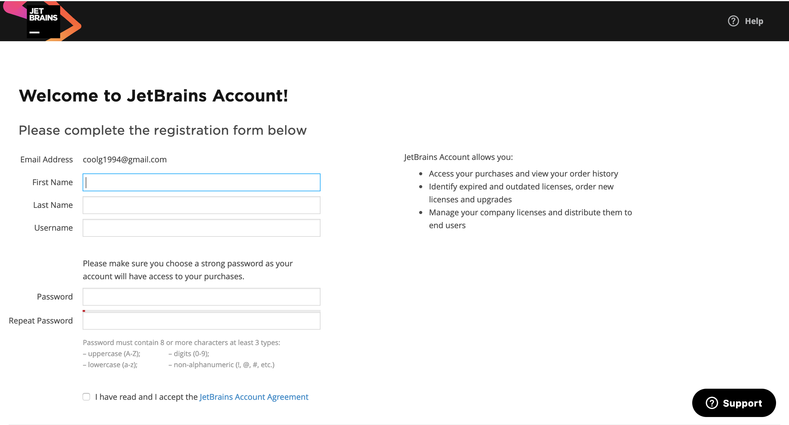
- here you fill out all your info and after you do that you start your download process
- while WebStorm is downloading move on to github and create an account
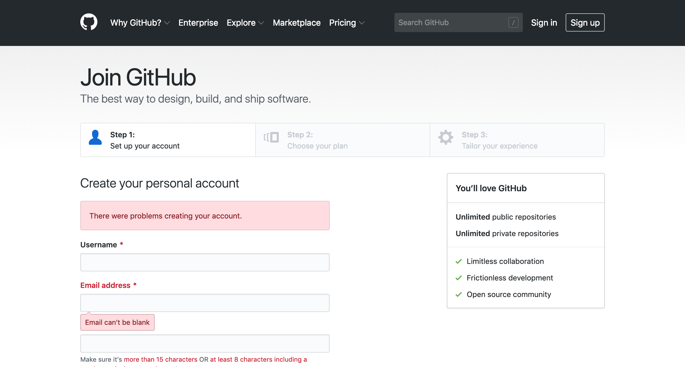
- after you are done creating that check on your WebStorm download. it should be done by now.
- after your download you are going to have to do some configuration. After all of that you can start on your new project
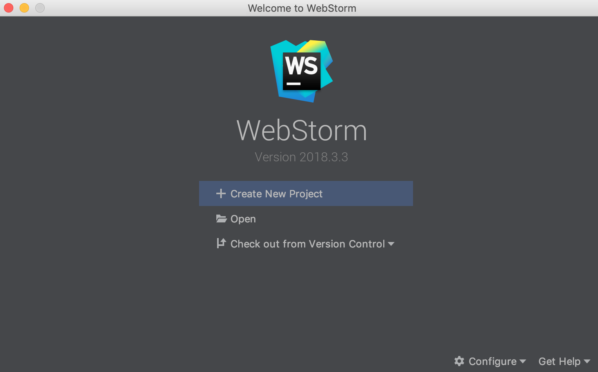
- when you first open up WebStorm this the what is gonna shown to you. Just click on create new project.
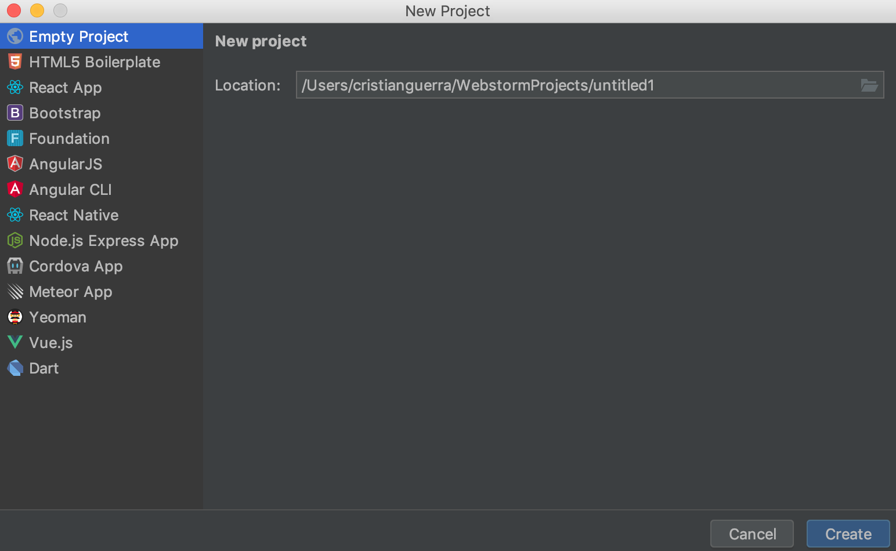
- this is the prompt you are going to receive after clicking create new project. for the sake of this tutorial we are just going with empty project. click create after.
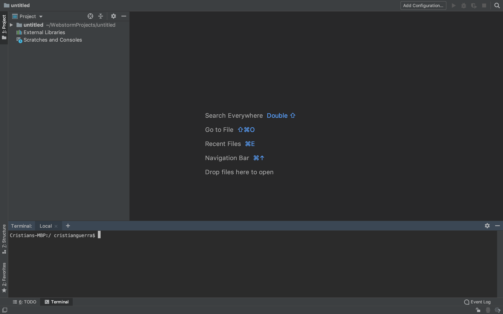
- this is the interface. Get use to it because you are going to see it for a while
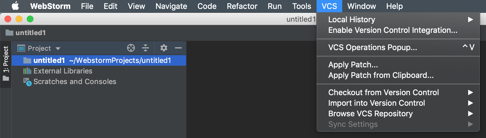
- before we do any coding, click on VCS and then click enable version control integration. this will give us Git
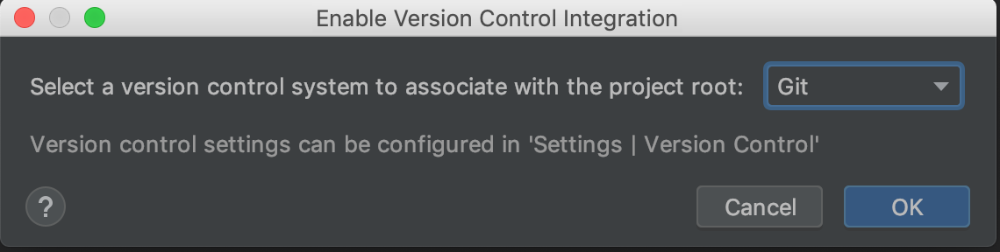
- once you click that this menu is gonna appear. Click the drop down menu and click git and then click ok
- Now lets do a small recap. We have a GitHub account, we have a WebStorm account and WebStorm downloaded and integrated Git into our WebStorm.
- After all of that we are going back into GitHub to create our first repository.
- go back to GitHub
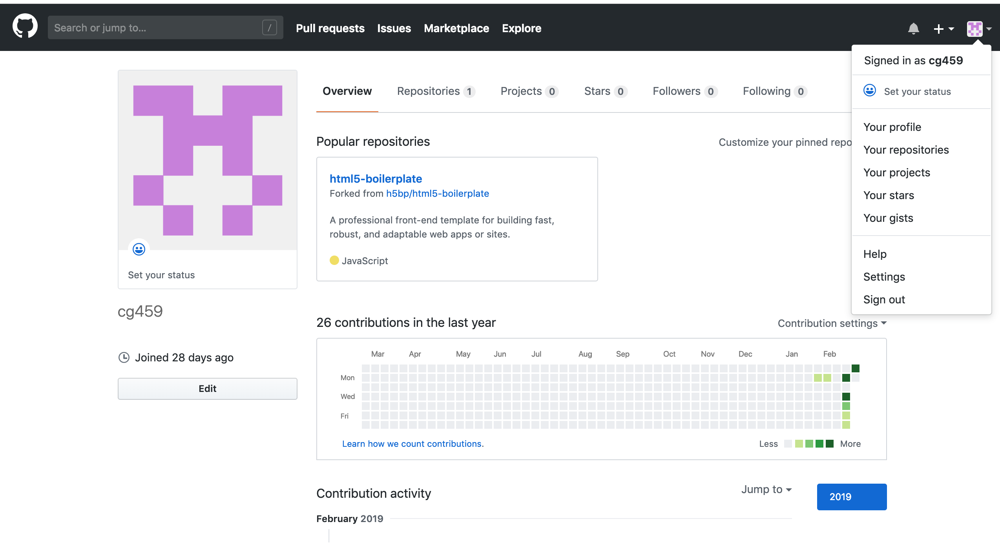
- once you are in GitHub go into your account. after that click on your profile icon on the top right. 
- Once you click that a drop down menu is going to appear. 
- Click on Your repositories
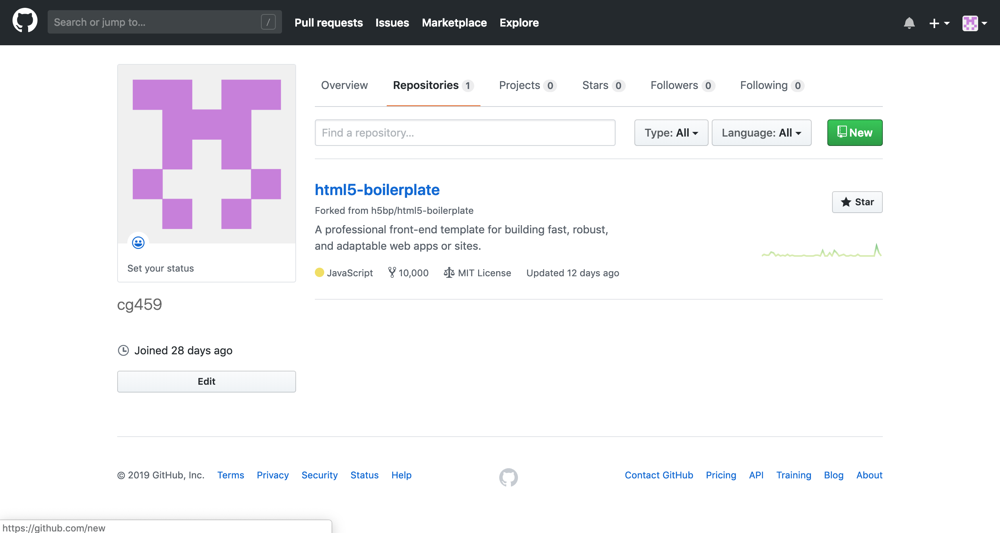
- after that, click on the big green button on the top right corner that says New.
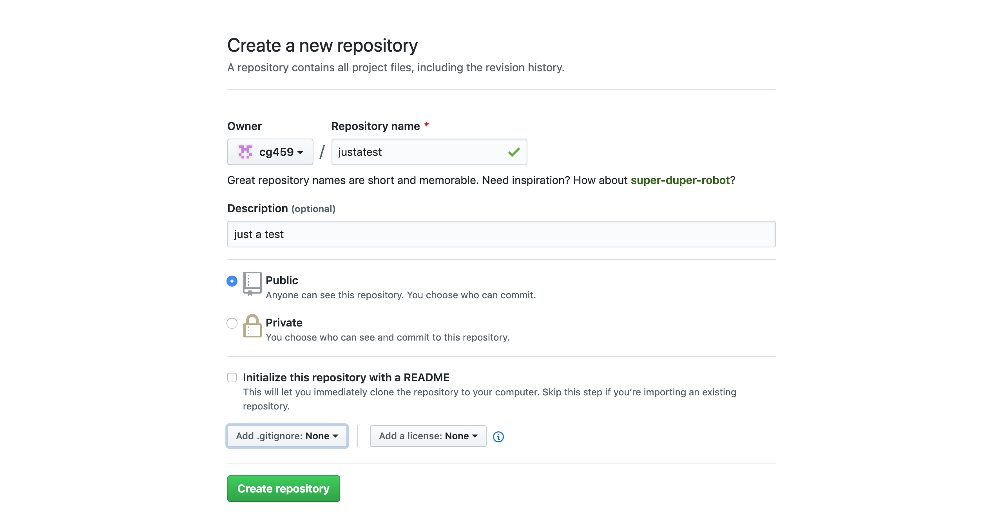
- this is what you are going to see when you want to create a new Repo.
- It is very straight forward. For this demonstration we are going to leave everything as is but you should include a README file.
- after you are done configuring click the create repository button.
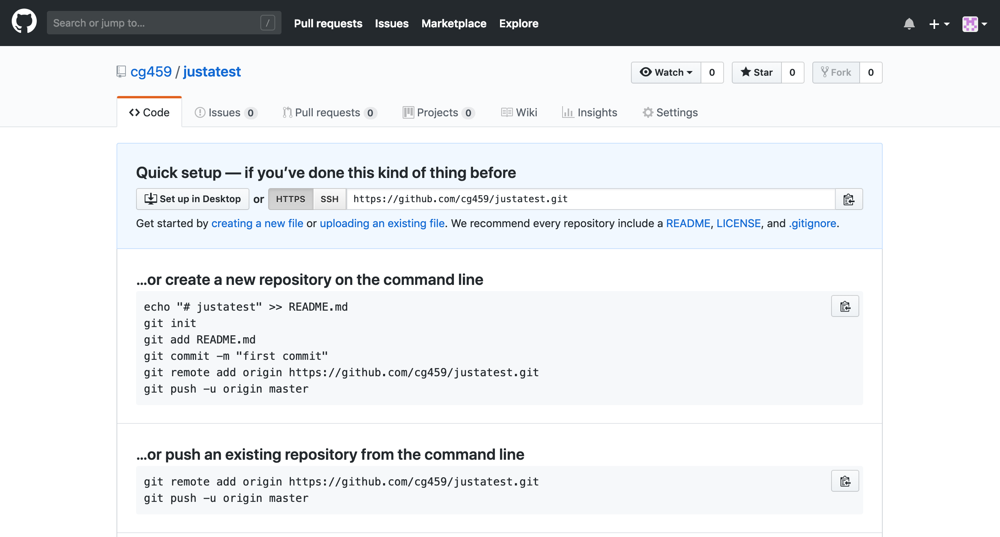
- once you click create repository, you will be moved to this page.
- copy the link that is next to SSH button. That is our link for our Git
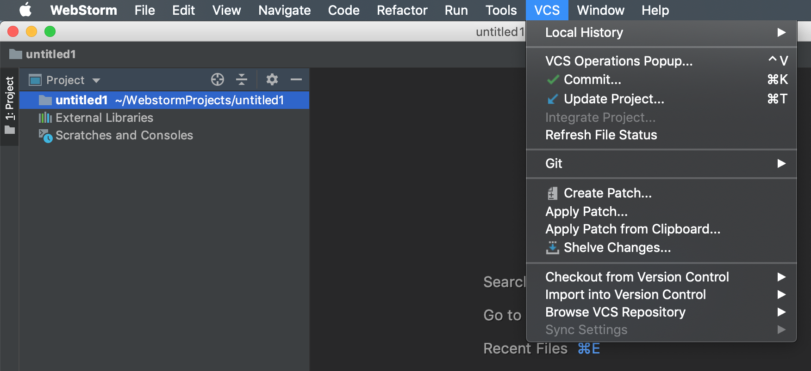
- go back to WebStorm and go under VCS again. once the drop down menu appears hover your mouse over Checkout from Version Control
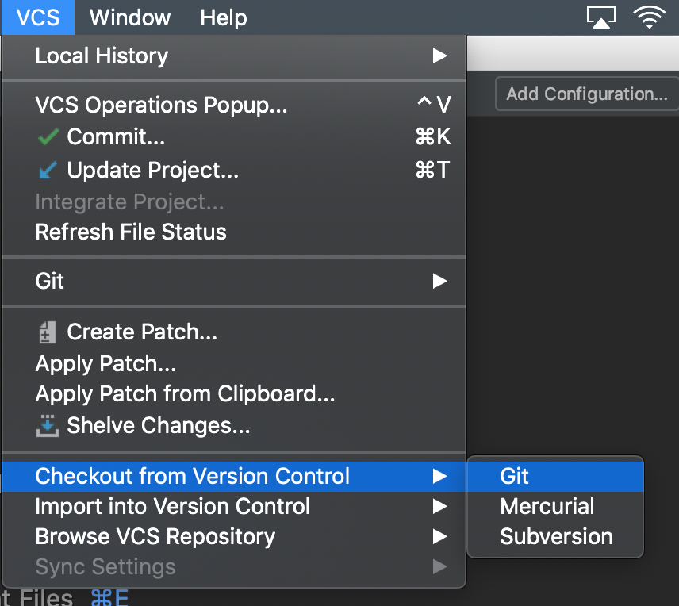
- once you do that click on Git
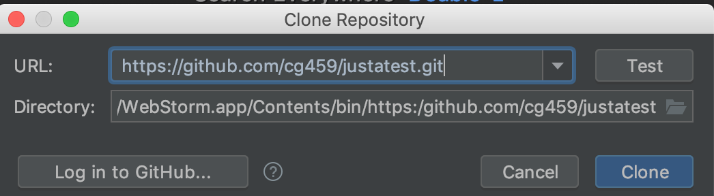
-after clicking Git, you past the link in the URL option and click clone.
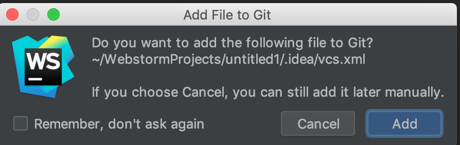
- you might or might not get this message. It is just going to add the 
